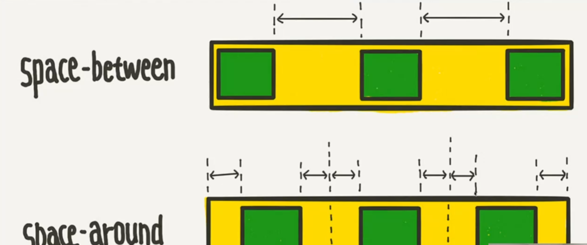

### 개요
레이아웃 정의에 사용  
Grid가 최신 기능이지만 Flex도 쓰는게 좋다.
- 상황에 따라 Flex가 더 편할때가 있음
- IE를 지원해야 하는 경우


### 속성
#### display
- inline-flex: inline block
- flex: block


#### flex-direction  
메인 축 속성
- row `Default`  
왼쪽으로 오른쪽으로 정렬
- row-reverse  
오른쪽에서 왼쪽으로 정렬
- column  
위에서 아래로 정렬
- column-reverse  
아래에서 위로 정렬
  
#### flex-wrap  
요소의 총 길이가 화면보다 클 경우 로직 결정
- nowrap `Default`   
줄바꿈 없음
- wrap  
줄바꿈
- wrap-reverse  
줄바꿈하되, 뒤 요소부터 wrap과 반대로 줄바꿈

#### flex-flow  
`flex-direction`과 `flex-flow`를 간단하게 적고 싶을 경우 사용  
```css
{
  flex-flow: row wrap;
}
```
```css
/* 위와 동일 */
{
  flex-direction: row;
  flex-wrap: wrap;
}
```

#### justify-content  
주 축에대한 정렬 속성값
- flex-start `Default`
- flex-end
- center
- space-between  
아이템 사이 간격을 동일하게 가짐
- space-around  
아이템 양옆과 사이 간격을 동일하게 가짐
- space-evenly  
아이템 모든 여백을 동일하게 가짐  
(IE 사용 불가)
    
  
#### align-items
주 축이 아닌 교차축에 대한 정렬 속성값  
- stretch `Default`
- flex-start
- flex-end
- center
- baseline

#### align-content
`align-items`과 비슷하다 생각하기 쉬우나, `flex-wrap: wrap`일때만 적용됨  
`align-items`는 교차축에 대한 속성  
`align-content`는 `flex-wrap: wrap`이 설정되어 있을 경우 교차축에 대한 속성
- stretch `Default`
- flex-start
- flex-end
- center

#### flex-grow
크기가 늘어날 떄 요소를 같이 늘리고 싶을 때  
빈 공간을 나눠 갖는 상대값
> 요소 3개가 0, 1, 2를 갖는다면  
> 0 요소는 늘어나지 않음  
> 1 요소는 2 요소보다 1/2만큼 늘어남  
> 2 요소는 1 요소보다 2배 만큼 늘어남
- 0 `default`

#### flex-shrink
`flex-grow`의 반대 개념
크기가 줄어들 떄 요소를 같이 줄이고 싶을 때
빈 공간을 나눠 갖는 상대값
- 1 `default`

#### flex
`flex-grow`, `flex-shrink`, `flex-basis`를 한번에 설정하고 싶을 경우 사용
```css
{
  flex: 1;
  /* flex-grow: 1; flex-shrink: 1; flex-basis: 0% */
  flex: 1 500px;
  /* flex-grow: 1; flex-shrink: 1; flex-basis: 500px; */
}
```
> ** flex는 콘텐츠가 많아질 경우 width 비율을 유지해주지 않는다.  
> 유지하고 싶다면 width 속성을 이용하는게 좋다.

#### margin-auto
flex만으로는 아이템 하나만 정렬할 순 없다  
하나만 이동시키고 싶을 떄 유용한 기법
```css
{
  /* 남은 공간 모두를 활용해 left 마진을 생성 */
  margin-left: auto;
}
```

#### align-self
`align-item`를 개별로 설정하고 싶을 경우 사용

#### order
item의 순서를 결정  
시각적인 순서를 바꾸는 거라 HTML 요소의 순서는 바뀌지 않는다.  
따라서 스크린 리더같은거엔 적용되지 않음

#### z-index
우리가 아는 그 `z-index`와 같다.
